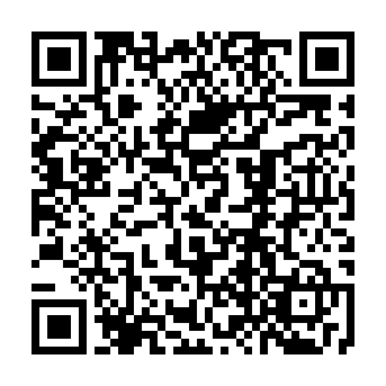
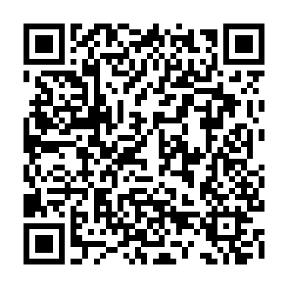

# SubScraper / up-load

A lightweight Python tool for scraping subscription links, extracting valid VLESS/Trojan configs, testing connectivity, and exporting clean working results.

## QR Code





## Last Updated

- 2026-08-09

## Overview

This project reads subscription sources from the `Resources/subs.txt` file, fetches the remote content, parses supported configurations, filters working entries by connectivity check, and writes the final valid list to:

- `Configs/tcp_pass/normal.txt`

It can also generate a QR code image in the `qrcode/` folder for sharing or quick access.

## Features

- Async fetching of subscription URLs
- Extraction of VLESS/Trojan links
- Base64 decode support
- URL normalization and parsing
- TCP/HTTP validation check for working nodes
- Output sorting by response time
- QR code generation for the final config source

## Project Structure

```text
.
├── main.py
├── pyproject.toml
├── requirements.txt
├── README.md
├── Resources/
│   └── subs.txt
├── Configs/
│   └── tcp_pass/
│       ├── normal.txt
│       └── SNI-Spoofing.txt
├── qrcode/
│   └── tcp-pass.png
└── test/
```

## Requirements

- Python 3.14+
- Dependencies listed in `requirements.txt`

Install dependencies:

```bash
pip install -r requirements.txt
```

Or use the project virtual environment:

```bash
python -m venv .venv
.venv\Scripts\activate
pip install -r requirements.txt
```

## Usage

Run the scraper:

```bash
python main.py
```

The script will:

1. Load subscription URLs from `Resources/subs.txt`
2. Download and parse each subscription
3. Filter valid links
4. Test each host
5. Save the best working configs to `Configs/tcp_pass/normal.txt`
6. Generate the QR code image in `qrcode/tcp-pass.png`

## Notes

- The script is designed for testing and generating usable proxy config lists.
- Some endpoints may be blocked or rate-limited depending on network conditions.
- The generated config output should be reviewed before use in production environments.

## License

This project is provided for educational and testing use.
